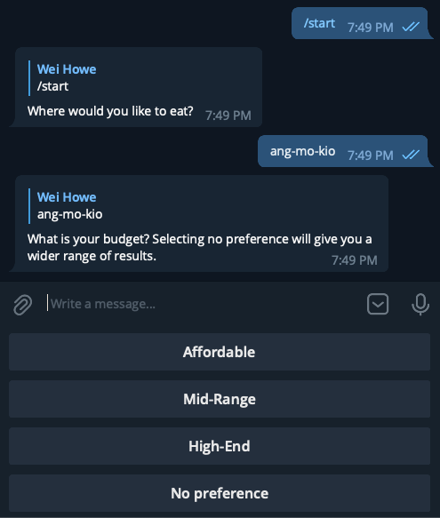
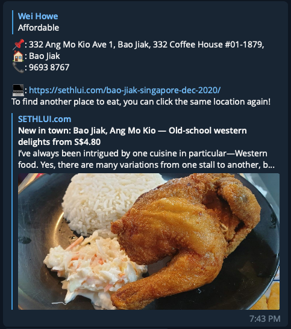

# tonighteatwhere
Unsure of what to eat tonight in Singapore? This bot can help you find food locations depending on your location and food budget. 
You can try it out on telegram at: [Try the bot!](https://t.me/tonighteatwhere_bot)

## Disclaimer
Webscraping done for educational and project purposes only. By no means have I tried to profit off data scraped, or attempted to destablise the original websites for personal gain. All content belongs to respective owners of website.

## How to use
To start the bot, you can run the `/start` command.

A list of MRT stations :steam_locomotive:, will be presented to you. Click on the *on-screen keyboard* to select the location you want! You will now be prompted to choose the budget that you have. Only selected locations have filter for budgets :moneybag:. You can select *No preference* to guarentee that you will get a result! Enjoy the random selection of food curated by the bot. Happy exploring!
|  |  |
| -- | -- |

## Motivation
As Singaporeans, we all take pride in our food :bento:. Usually, we are spoilt for a choice of good food, and can't decide where to eat. This bot aims to help introduce new food that have been reviewed, making it easy for people to discover new places.

From a technical standpoint, I created this project with the intention about learning about `telegram's API`. Moreover, I wanted to sharpen my `Postgresql` skills that I have learnt over the previous semester, while learning about webscraping.

## Framework
This project was created with:
* Python v3.8.1
* bs4 v4.10.0
* pytelegrambotapi v 4.2.2
* psycopg2 v2.9.2

## Usage
You will have to download the dependencies as stated in `requirements.txt`. Dependencies can be downloaded via running `pip3 install bs4`.
Afterwards, you will have to provision your own telegram `API_KEY` that you can get from the [Botfather](https://core.telegram.org/bots)
Next, you have to use your own database (local/hosted database) and replace the `DATABASE_URL` with that of your own. You could also connect via [credentials](https://www.psycopg.org/docs/module.html) of your database.
Run `MTC.py`, `Seth.py`, then run `Main.py`. 

